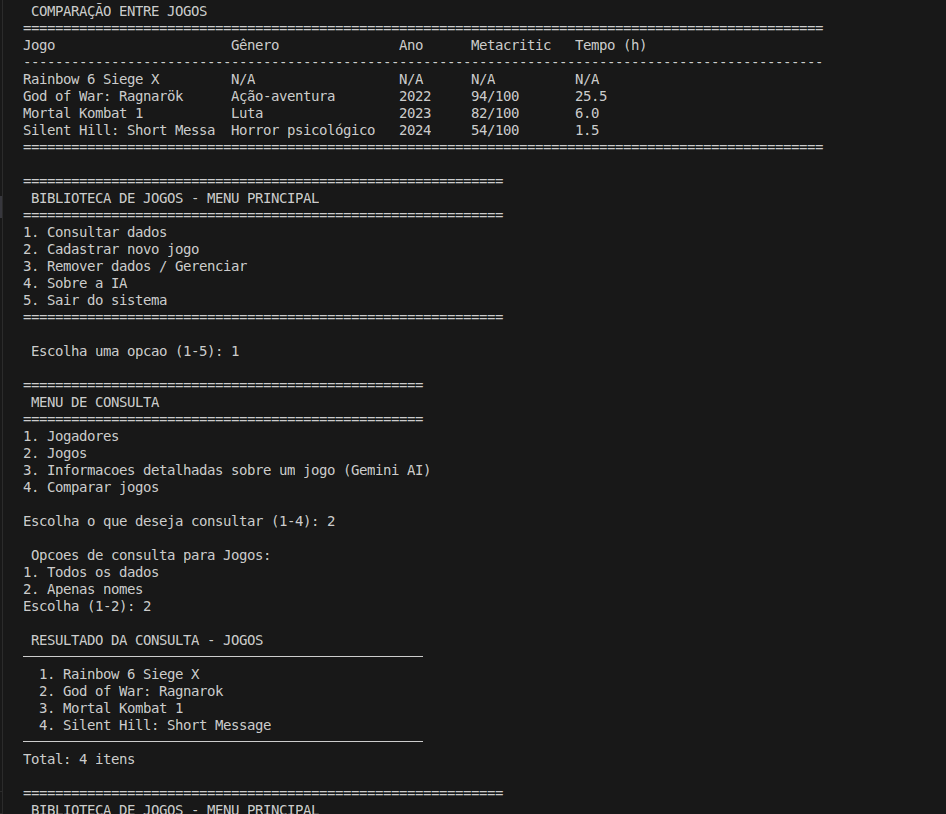

# Sistema de Biblioteca de Jogos



**Versao:** 1.0.0  
**Status:** Ativo  


**CI Status:**   
**Python:** 

Um sistema completo para gerenciamento de biblioteca pessoal de jogos com integracao de inteligencia artificial para obtencao de informacoes detalhadas sobre titulos.

---

## Funcionalidades Principais

### Gerenciamento de Dados
- Cadastro de jogadores com perfil personalizado
- Cadastro de jogos com informacoes detalhadas
- Consulta e filtragem de dados
- Remocao segura de registros
- Interface amigavel via terminal

### Inteligencia Artificial Integrada
- Consulta automatica de informacoes de jogos via Google Gemini AI
- Cache inteligente para reduzir chamadas a API
- Comparacao entre multiplos jogos
- Recomendacoes personalizadas baseadas em genero
- Informacoes atualizadas sobre desenvolvedores, publicadores e avaliacoes

### Sistema de Seguranca
- Autenticacao por palavra-chave
- Protecao de dados por usuario
- Validacao de credenciais
- Acesso restrito aos proprios dados

---

## Tecnologias Utilizadas

| Componente | Tecnologia | Versao |
|------------|------------|---------|
| Backend | Python | 3.9+ |
| Banco de Dados | Microsoft SQL Server | 2019+ |
| API Externa | Google Gemini AI | v1beta |
| ORM/Driver | pyodbc | 4.0+ |
| Manipulacao de Dados | pandas | 1.5+ |
| Variaveis de Ambiente | python-dotenv | 1.0+ |
| Requisicoes HTTP | requests | 2.31+ |
| CI/CD | GitHub Actions | - |
| Testes | pytest | 7.0+ |
---

## Pre-requisitos

### 1. Sistema Operacional
- Windows 10/11, macOS 10.14+, ou Linux (Ubuntu 20.04+, Fedora 32+)

### 2. Banco de Dados
- SQL Server 2019 ou superior
- ODBC Driver 17 for SQL Server
- Permissoes para criar banco de dados e tabelas

### 3. Python
- Python 3.8 ou superior
- pip (gerenciador de pacotes Python)

### 4. API Externa
- Conta Google valida
- Chave de API do Google Gemini AI (obter em: https://makersuite.google.com/app/apikey)

---

## Instalacao e uso

# Clonar o Repositorio
```bash
-git clone https://github.com/seu-usuario/biblioteca-jogos.git
-cd biblioteca-jogos

# Criar ambiente virtual
-python -m venv venv

# Ativar ambiente virtual
# Windows:
-venv\Scripts\activate
# Linux/Mac:
-source venv/bin/activate

# Instalar dependencias necessarias 
-pip install -r requirements.txt

# Configure banco de dados automaticamente
python setup_database.py

#  Configurar Variaveis de Ambiente
# Copiar arquivo de exemplo
-cp .env.example .env

# Editar o arquivo .env com suas credenciais
# Configure: DB_SERVER, DB_NAME, DB_USER, DB_PASSWORD, GEMINI_API_KEY

# Executar o Sistema
-python main.py

# Executar Testes Localmente
-bash
# Instalar dependencias de desenvolvimento
-pip install pytest

# Executar todos os testes
-python -m pytest tests/ -v

# Executar teste especifico
-python tests/test_basic.py

# Estrutura do Projeto
Biblioteca_jogos/
├── .github/
│   └── workflows/
│       └── ci.yml           # Pipeline de CI/CD
├── tests/
│   └── test_basic.py        # Testes basicos do sistema
├── database/
│   ├── connection.py        # Conexao com SQL Server
│   ├── functions.py         # Operacoes CRUD
│   └── scripts.py           # Scripts SQL
├── models/
│   ├── jogador.py           # Modelo Jogador
│   └── jogo.py              # Modelo Jogo
├── api/
│   └── gemini_client.py     # Cliente Gemini AI
├── utils/
│   ├── display.py           # Utilitarios de exibicao
│   └── gemini_utils.py      # Utilitarios Gemini
├── main.py                  # Programa principal
├── requirements.txt         # Dependencias
├── .gitignore              # Arquivos que nao podem ser versionados
└── .env.example            # Modelo de credenciais
# Fluxo Explicado por Etapas

┌─────────────────────────────────────────────────────────────┐
│                    SISTEMA DE BIBLIOTECA                    │
├─────────────────────────────────────────────────────────────┤
│ 1. INÍCIO                                                   │
│    └─► Inicializar sistema                                  │
│        └─► Carregar configurações (.env)                    │
│        └─► Testar conexões (BD, Gemini)                     │
│                                                             │
│ 2. AUTENTICAÇÃO                                             │
│    └─► Usuário existe? ──SIM──► Login                       │
│        │   │                     └─► Validar credenciais    │
│        │   │                     └─► Acesso concedido       │
│        │   NÃO                                              │
│        └─► Cadastrar novo usuário                           │
│            └─► Coletar dados                                │
│            └─► Salvar no BD                                 │
│            └─► Ir para Login                                │
│                                                             │
│ 3. MENU PRINCIPAL (Loop)                                    │
│    └─► Opção 1: CONSULTAR                                   │
│        ├─► Jogadores: listar/filtrar                        │
│        ├─► Jogos: listar/filtrar                            │
│        ├─► IA: consultar Gemini AI                          │
│        │   ├─► Ver cache primeiro                           │
│        │   ├─► Se cache miss: chamar API                    │
│        │   ├─► Processar resposta                           │
│        │   └─► Atualizar cache                              │
│        └─► Comparar: múltiplos jogos                        │
│                                                             │
│    └─► Opção 2: CADASTRAR                                   │
│        └─► Coletar dados do jogo                            │
│        └─► Validar informações                              │
│        └─► Inserir no BD                                    │
│                                                             │
│    └─► Opção 3: REMOVER/GERENCIAR                           │
│        ├─► Remover jogador (encerra sessão)                 │
│        ├─► Remover jogo                                     │
│        └─► Limpar cache Gemini                              │
│                                                             │
│    └─► Opção 4: SOBRE A IA                                  │
│        └─► Exibir informações técnicas                      │
│                                                             │
│    └─► Opção 5: SAIR                                        │
│        └─► Fechar conexões                                  │
│        └─► Encerrar sistema                                 │
│                                                             │
│ 4. TRATAMENTO DE ERROS                                      │
│    ├─► Conexão BD falha → Mensagem → Tentar reconectar      │
│    ├─► API Gemini falha → Usar cache/local → Continuar      │
│    ├─► Dados inválidos → Validar → Pedir correção           │
│    └─► Erro crítico → Log → Encerrar graciosamente          │
└─────────────────────────────────────────────────────────────┘